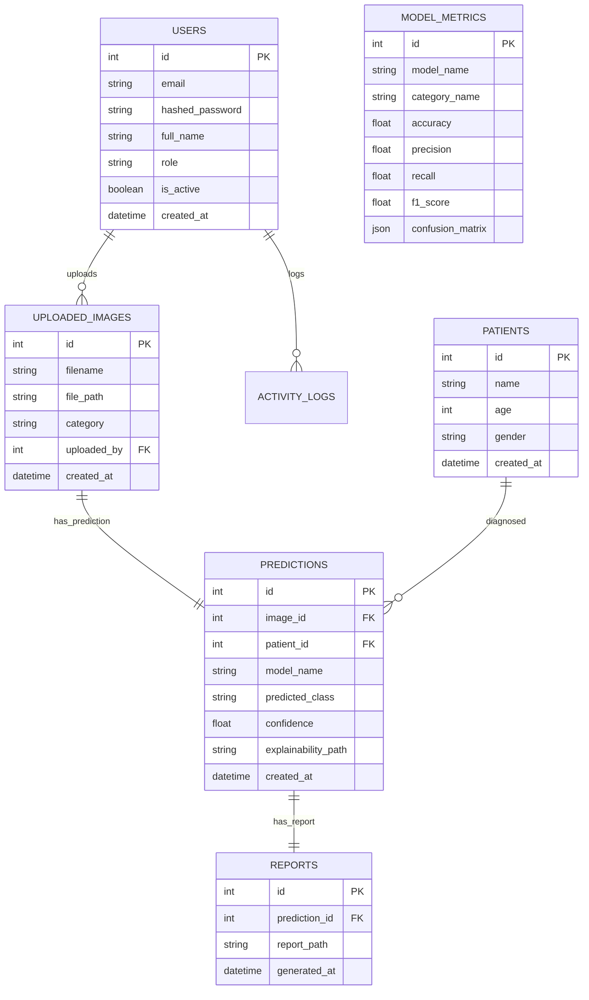

# MedVision AI – Intelligent Disease Detection & Health Analytics Platform

MedVision AI is a production-grade AI-powered healthcare technology solution designed for clinical decision support. The platform processes medical imaging scans, classifies pathology classifications with confidence percentages, maps heatmaps via Explainable AI (Grad-CAM), compiles downloadable PDF medical reports, and tracks diagnostic metrics over time in a premium dashboard.

---

## 🌐 Live Deployed Application

*   **Production Web App (Vercel)**: [https://med-vision-ai-platform.vercel.app](https://med-vision-ai-platform.vercel.app)
*   **Production API Server (Render)**: [https://medvision-backend-uhe7.onrender.com](https://medvision-backend-uhe7.onrender.com)
*   **Interactive Swagger API Docs**: [https://medvision-backend-uhe7.onrender.com/docs](https://medvision-backend-uhe7.onrender.com/docs)

---

## 👨‍💻 Developer Information

*   **Lead Architect**: PODUGU MUKESH
*   **Email**: [mukeshpodugu123@gmail.com](mailto:mukeshpodugu123@gmail.com)
*   **Phone**: +91 8143999463
*   **Location**: Srikakulam, Andhra Pradesh, India

---

## 📄 Resume Description

Developed MedVision AI, a deep learning-based disease detection platform capable of identifying diseases from medical images using CNN architectures such as ResNet50 and EfficientNet. Implemented image classification, explainable AI visualizations, patient management, report generation, analytics dashboards, REST APIs, authentication, and cloud-ready deployment using Python, TensorFlow, FastAPI, PostgreSQL, React, and Docker.

---

## 🚀 Key Platform Features

1.  **Multi-Modality Diagnostic Classifier**:
    *   **Chest X-Ray Analysis**: Normal, Pneumonia, Tuberculosis
    *   **Skin Disease Detection**: Melanoma, Eczema, Psoriasis, Acne, Healthy Skin
    *   **Brain MRI Scan**: Brain Tumor, Normal Brain
    *   **Diabetic Retinopathy**: Normal, Mild, Moderate, Severe
2.  **Explainable AI (Grad-CAM)**: Visualizes gradient activation maps over convolutional layers, highlighting precisely which pixel segments drove model predictions.
3.  **PDF Report Compilation**: Auto-compiles patient details, scan image, diagnostic outputs, and AI-interpretive findings into a print-ready document.
4.  **Health Analytics Dashboard**: Real-time stats on monthly scans, disease rates, and accuracy benchmarks via interactive Line, Pie, and Bar charts (Chart.js).
5.  **Admin Telemetry**: Audits system accesses, logs actions, manages users, and lets admins adjust neural model evaluation weights.

---

## 🏗️ Folder Structure

```text
medvision-ai/
├── backend/
│   ├── app/
│   │   ├── api/              # REST Endpoints (auth, predictions, analytics, etc)
│   │   ├── core/             # Configuration, database setup, JWT security
│   │   ├── services/         # CNN models inference, Grad-CAM overlays, ReportLab PDFs
│   │   ├── tests/            # Automated Pytest suites
│   │   └── main.py           # FastAPI entrypoint & DB seeder
│   ├── Dockerfile
│   ├── requirements.txt      # Python dependencies
│   └── train_models.py       # CNN training & metrics script
├── frontend/
│   ├── src/
│   │   ├── components/       # UI Components (Sidebar, Dashboard, workspace, support)
│   │   ├── App.jsx           # Main routing & state controller
│   │   ├── api.js            # Axios client services
│   │   ├── index.css         # Tailwind & custom scrollbar/glass styles
│   │   └── main.jsx          # App mounter
│   ├── index.html            # Google Font imports & SEO headers
│   ├── Dockerfile
│   ├── package.json
│   ├── postcss.config.js
│   └── tailwind.config.js    # Custom Tailwind styling
├── docker-compose.yml        # Orchestration layer
└── README.md                 # Main Documentation
```

---

## 📊 Database Design & ER Diagram

The database utilizes **PostgreSQL** (with a standalone SQLite file fallback for rapid local testing). 

### 🗄️ Database Tables
*   `users`: Authentication credentials (emails, passwords hashes, role levels).
*   `patients`: Clinician profiles database (names, ages, genders).
*   `uploaded_images`: Scan properties (filenames, relative file paths, categories).
*   `predictions`: Classifier metadata (confidence scores, predicted classes, Grad-CAM links).
*   `reports`: Medical documents table (PDF download paths).
*   `model_metrics`: Performance trackers (accuracy, precision, F1, confusion matrices JSON).
*   `activity_logs`: System audit trail records (log entries, user IDs, timestamps).

### 📐 Entity-Relationship Diagram



---

## 🔌 API Documentation (FastAPI REST Endpoints)

FastAPI automatically serves interactive Swagger documentation. You can access it locally at `http://localhost:8000/docs` or on the live server at [https://medvision-backend-uhe7.onrender.com/docs](https://medvision-backend-uhe7.onrender.com/docs).

### Authentication Gateway (`/api/v1/auth`)
*   `POST /register`: Registers a new clinician or administrator profile.
*   `POST /login`: Receives credentials (OAuth2 flow) and returns a signed JWT access token.
*   `GET /me`: Returns details of the currently authenticated user session.

### Patient Management (`/api/v1/patients`)
*   `POST /`: Creates a new patient profile.
*   `GET /`: Lists all patient profiles (with `?search=` filter by name).
*   `GET /{id}/predictions`: Fetches the entire diagnostic scan history for a specific patient.

### Scan Diagnostics (`/api/v1/predictions`)
*   `POST /analyze`: Main endpoint. Accepts multipart/form-data upload (scan image, categories selection, patient metadata) and executes CNN model classification, generates Grad-CAM overlays, registers DB items, and drafts a PDF report.
*   `GET /`: Fetches all scan predictions (with search, category, and min_confidence filters).

### Medical Reports (`/api/v1/reports`)
*   `GET /{prediction_id}/download`: Serves the generated PDF file for direct browser download.

### Dashboards Telemetry (`/api/v1/analytics`)
*   `GET /dashboard`: Aggregates monthly diagnostic workloads, disease distributions, and model performance metrics.

### System Audits (`/api/v1/admin`)
*   `GET /logs`: Fetches the system activity logs (Admin Only).
*   `POST /metrics`: Updates neural model calibration accuracies (Admin Only).

---

## ⚙️ Model Training Workflow (`train_models.py`)

The platform contains an evaluation script that trains models (custom CNN overlays) or generates metrics when running in developer environments.

### Process
1.  **Synthetic Dataset Synthesis**: Generates NumPy representations of medical scans containing specific pathologies (e.g. consolidations in chest X-rays, round masses in brain MRI).
2.  **Data Augmentation**: Integrates `ImageDataGenerator` to apply rotations, shifts, and horizontal flips.
3.  **Regularization**: Implements Early Stopping and Model Checkpoint callbacks during Keras fittings.
4.  **Evaluation Matrix**: Evaluates metrics (Accuracy, Precision, Recall, F1) and generates Confusion Matrices, writing these metrics straight to the database.

To execute the evaluations script offline:
```bash
cd backend
python train_models.py
```

---

## 🐳 Containerized Deployment Guide (Docker)

To run the complete platform (PostgreSQL DB, FastAPI Backend, React Frontend) orchestrated via Docker Compose:

### 1. Prerequisite
Ensure [Docker Desktop](https://www.docker.com/products/docker-desktop/) is installed and running.

### 2. Startup Command
Navigate to the root folder of the project containing `docker-compose.yml` and run:
```bash
docker-compose up --build -d
```

### 3. Verify Containers
Once the build completes:
*   **React Frontend Dashboard**: Access via browser at `http://localhost:3000`
*   **FastAPI Backend API Docs**: Access via Swagger at `http://localhost:8000/docs`
*   **Database (PostgreSQL)**: Internal connection at port `5432`

---

## 🛠️ Local Manual Deployment Guide (Non-Docker)

### 1. Backend Server Setup
Make sure Python 3.10+ is installed.
```bash
cd backend
python -m venv venv
venv\Scripts\activate
pip install -r requirements.txt
uvicorn app.main:app --reload
```
*The database file `medvision.db` will initialize as a local SQLite instance and auto-seed sample doctor/admin accounts.*

### 2. Frontend React Setup
Ensure Node.js 18+ is installed.
```bash
cd frontend
npm install
npm run dev
```
*The dev server will run locally at `http://localhost:5173`.*

### 3. Pre-seeded Demo Credentials
Log into the platform using the following accounts:
*   **Clinician Account**: `mukesh@medvision.ai` / Password: `MukeshPassword123`
*   **Admin Account**: `admin@medvision.ai` / Password: `AdminPassword123`

---

## 🧪 Testing Guide

We write test cases to check authorization gates, upload validations, and CRUD endpoints.

To run the automated tests using `pytest`:
```bash
cd backend
pytest -v
```
